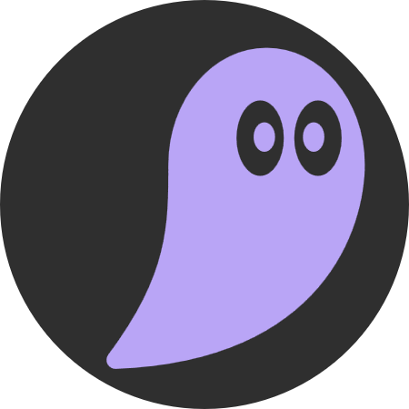

## 🔧 Active Development  
**This project is currently under heavy development.**  
Bugs, missing features and some chaos are expected right now 😄  
If you’ve got ideas, tips or recommendations — **I’d love to hear them!**

# Geist



A minimal, elegant, and modern dashboard application built with Vue 3, TypeScript, and Pocketbase.

## ✨ Features

- **🎨 Beautiful Theme System** - Light and dark themes with pastel colors
- **⚡ Fast & Responsive** - Built with Vue 3 Composition API and TypeScript
- **🎯 Modern Architecture** - Clean component structure with proper separation of concerns
- **🌈 CSS Variables** - Theme-driven styling system for consistent aesthetics
- **📱 Mobile Friendly** - Responsive design that works on all devices
- **🔄 State Management** - Pinia for centralized state management
- **🛣️ Routing** - Vue Router for seamless navigation
- **🎪 Drag & Drop** - Interactive draggable cards with smooth animations

## 🚀 Quick Start

### Prerequisites

- Node.js 16+ or Bun
- npm, yarn, or bun package manager

### Installation

```bash
# Clone the repository
git clone <repository-url>
cd geist

# Install dependencies
npm install
# or with bun
bun install
```

### Development

```bash
# Start the development server
npm run dev
# or with bun
bun run dev
```

The app will be available at `http://localhost:5173`

### Build for Production

```bash
npm run build
# or with bun
bun run build
```

## 📁 Project Structure

```
geist/
├── src/
│   ├── components/
│   │   └── app/
│   │       ├── AppHeader.vue      # Main header component
│   │       ├── GeistLogo.vue      # Logo component
│   │       └── ThemeSwitcher.vue  # Theme selector
│   ├── views/
│   │   └── HomeView.vue           # Home page
│   ├── theme/
│   │   ├── themes.ts              # Theme definitions
│   │   └── useTheme.ts            # Theme composable
│   ├── router/
│   │   └── index.ts               # Vue Router configuration
│   ├── stores/                    # Pinia state stores
│   ├── App.vue                    # Root component
│   ├── main.ts                    # Application entry point
│   └── style.css                  # Global styles & CSS variables
├── public/                        # Static assets
├── index.html                     # HTML template
├── vite.config.ts                # Vite configuration
├── tsconfig.json                 # TypeScript configuration
└── package.json                  # Dependencies
```

## 🎨 Theme System

The app includes a sophisticated theme system with:

- **Light Theme** - Soft whites and grays with lavender accents
- **Dark Theme** - Deep blacks with lavender accents

Themes are managed through:

- `src/theme/themes.ts` - Define theme colors
- `src/theme/useTheme.ts` - Composable for theme switching
- `src/style.css` - CSS variables for styling

### CSS Variables

All colors use semantic CSS variables:

```css
--bg                /* Primary background */
--surface           /* Secondary surfaces */
--surface-soft      /* Tertiary surfaces */
--text              /* Primary text */
--text-muted        /* Secondary text */
--accent            /* Accent color (pastel lavender) */
--accent-soft       /* Soft accent overlay */
--border            /* Border color */
```

## 🔌 Backend Integration

Ready for Pocketbase integration:

1. Install Pocketbase: <https://pocketbase.io/docs/>
2. Configure collections (users, user_settings, themes, links, etc.)
3. Update API endpoints in your components
4. Connect with Pocketbase REST API

Example API endpoint:

```typescript
const API_URL = 'http://localhost:8090'
```

## 📦 Tech Stack

- **Vue 3** - Progressive JavaScript framework
- **TypeScript** - Type-safe JavaScript
- **Vite** - Next-generation build tool
- **Pinia** - State management
- **Vue Router** - Client-side routing
- **CSS Variables** - Dynamic theming

## 🛠️ Available Scripts

```bash
npm run dev        # Start development server
npm run build      # Build for production
npm run preview    # Preview production build
npm run lint       # Run ESLint
npm run format     # Format code with Prettier
```

## 🎯 Best Practices

- Use CSS variables for all styling
- Keep components focused and reusable
- Use TypeScript for type safety
- Follow the component structure pattern
- Use Pinia for shared state

## 📝 Component Template

When creating new components, use this structure:

```vue
<script setup lang="ts">
// Imports and setup
</script>

<template>
  <!-- Template here -->
</template>

<style scoped>
/* Use CSS variables for styling */
.element {
  color: var(--text);
  background-color: var(--surface);
}
</style>
```

## 🌐 Browser Support

- Chrome/Chromium (latest)
- Firefox (latest)
- Safari (latest)
- Edge (latest)

## 📄 License

MIT License - feel free to use this project for anything!

## 🤝 Contributing

Contributions are welcome! Feel free to:

- Report bugs
- Suggest features
- Submit pull requests
- Improve documentation

## 🎓 Learning Resources

- [Vue 3 Documentation](https://vuejs.org/)
- [TypeScript Handbook](https://www.typescriptlang.org/docs/)
- [Vite Guide](https://vitejs.dev/guide/)
- [Pinia Documentation](https://pinia.vuejs.org/)
- [Pocketbase Documentation](https://pocketbase.io/docs/)

---

Built with ❤️ | Made with Vue 3 & TypeScript
